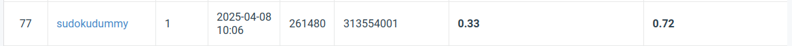

# Visual Recognition using Deep Learning Spring 2025 HW-2

StudentID: 313554001
Name: Lam Kin Ho

This repo contains code for the Visual Recognitionusing Deep Learning HW-2.

## Introduction

This task involved performing digit recognition using a Faster R-CNN architecture. Unlike the previous assignment, there are no constraints on the maximum number of model parameters. The dataset consists of real-world images containing digits, each annotated with a bounding box (bbox) around the digit. The task is twofold:

 - Predict the bounding boxes in the image.
 - Recognize the digits within each predicted box.

While the use of pretrained model weights is permitted, incorporating additional data during the training process is not allowed.

Following the principle of "standing on the shoulders of giants," I chose to leverage a pretrained model available through PyTorch. Before scaling up training, a comprehensive hyperparameter search was conducted. The final model was selected based on the highest mean Average Precision (mAP) score

## Installation

You are adviced to run this code in isolated python envrionment via conda/mamba

```sh
conda env create -f environment.yml
conda activate vr
```

## Repo Structure

`result`, `weights` folders should be created by user own since it is in the intentional excluded from the repo.

```sh
mkdir result
mkdir weights
```

The data should be downloaded by user own and unarchieve

```sh
pip install gdown
gdown https://drive.usercontent.google.com/open?id=13JXJ_hIdcloC63sS-vF3wFQLsUP1sMz5&authuser=5
tar xvf nycu-hw2-data.tar.gz
```

Before running any script, the project repo should look like

```sh
.
├── data/
│   ├── test/
│   ├── train/
│   ├── valid/
│   ├── train.json
│   └── valid.json
├── docs/
├── result/
├── src/
│   ├── dataset/
│   ├── models/
│   ├── train/
│   └── utils/
├── weights/
└── README.md
```

## Finetune

To train a model run

```sh
python src/main.py
```

Or systematically searching by

```sh
wandb sweep sweep.yml
wandb agent <sweep_id>
```

## Test model

To use a model, run

```sh
python src/predict.py
```

## Performance Snapshot


