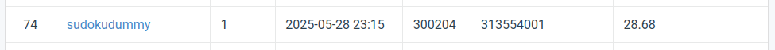

# Visual Recognition using Deep Learning Spring 2025 HW-3

StudentID: 313554001
Name: Lam Kin Ho

This repo contains code for the Visual Recognition using Deep Learning HW-4.

## Introduction

This project focuses on performing blind image restoration for weather-degraded images using the PromptIR architecture. Unlike traditional methods such as RIDNet and DID-MDN, which rely on explicit degradation modeling and assumptions about noise or rain distribution, PromptIR introduces a flexible, prompt-based framework that can adapt to diverse image corruptions, such as rain streaks and snow particles, without needing degradation type annotations.

The primary objectives of this task are:  

  - Restore images degraded by rain or snow while preserving structural and texture details.
  - Enable a single model to generalize across varying intensities and patterns of weather-based degradations.

Following the principle of "standing on the shoulders of giants," I utilized multiple predefined package, including albumenation, scikit-learn, pytorch, etc.. Before scaling up training, a comprehensive searching was conducted on learning rate, schedular and loss function. The final model was selected based on the highest peak-signal-to-noise ratio (PSNR).

## Installation

You are adviced to run this code in isolated python envrionment via conda/mamba

```sh
conda env create -f environment.yml
conda activate vr
```

## Repo Structure

`result`, `weights` folders should be created by user own since it is in the intentional excluded from the repo.

```sh
mkdir result
mkdir weights
```

The data should be downloaded by user own and unarchieve

```sh
pip install gdown
gdown 1bEIU9TZVQa-AF_z6JkOKaGp4wYGnqQ8w
tar xvf hw4-realse_dataset.tar.gz
```

Before running any script, the project repo should look like

```sh
.
├── data
│   ├── test
│   │   └── degraded/
│   └── train
│       ├── clean/
│       └── degraded/
├── result
├── docs/
├── result/                             # empty directory
├── src/
│   ├── dataset/
│   ├── models/
│   ├── train/
│   └── utils/
├── weights/                            # empty directoy
└── README.md
```

## Finetune

To train a model run

```sh
python src/main.py
```

Or systematically searching by

```sh
wandb sweep sweep.yml
wandb agent <sweep_id>
```

## Test model

To use a model, run

```sh
python src/predict.py
```

## Performance Snapshot


